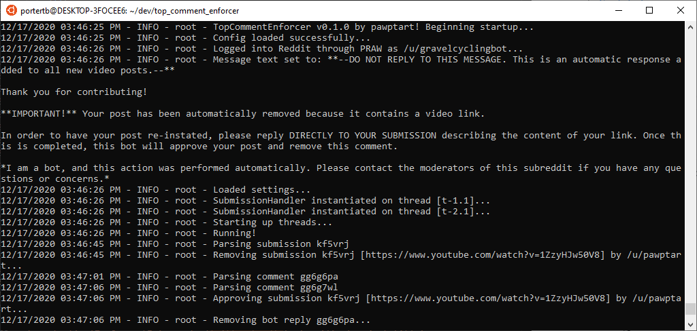

<br />
<p align="center">
  <h3 align="center">TopCommentEnforcer</h3>

  <p align="center">
    A Reddit bot to enforce top-level comments on link posts
    <br>
    ·
    <a href="https://github.com/pawptart/TopCommentEnforcer/issues">Report Bug</a>
    ·
    <a href="https://github.com/pawptart/TopCommentEnforcer/issues">Request Feature</a>
  </p>
</p>

<details open="open">
  <summary><h2 style="display: inline-block">Table of Contents</h2></summary>
  <ol>
    <li>
      <a href="#about-the-project">About The Project</a>
      <ul>
        <li><a href="#built-with">Built With</a></li>
      </ul>
    </li>
    <li>
      <a href="#getting-started">Getting Started</a>
      <ul>
        <li><a href="#prerequisites">Prerequisites</a></li>
        <li><a href="#installation">Installation</a></li>
      </ul>
    </li>
    <li><a href="#usage">Usage</a></li>
    <li><a href="#roadmap">Roadmap</a></li>
    <li><a href="#license">License</a></li>
    <li><a href="#contact">Contact</a></li>
  </ol>
</details>

## About The Project



`TopCommentEnforcer` is a a configurable Reddit bot to enforce top-level comments on link posts. 

An example usage would be a user that posts a YouTube link with no context. Normally, Reddit would only display a link to the video and the video title. `TopCommentEnforcer` removes the link post with a message to the author to include details about the link before it can be re-approved. Once the comment is made, the bot re-approves the post and deletes its message.

The bot is meant to be configurable -- links can be blacklisted using regular expressions (RegEx) or keywords, whichever the user is comfortable with. In addition, the removal message is also totally customizable.

### Built With

* [Python 3.8](https://www.python.org/downloads/)
* [PRAW](https://praw.readthedocs.io/en/latest/code_overview/models/submission.html)
* [pipenv](https://pypi.org/project/pipenv/)

## Getting Started

To get a local copy up and running follow these simple steps.

### Prerequisites

This is an example of how to list things you need to use the software and how to install them.

* `pipenv` installation (if you don't already have it)

  ```sh
  sudo pip3 install pipenv
  ```

### Installation

1. Clone the repo

  ```sh
  git clone https://github.com/pawptart/TopCommentEnforcer.git
  ```

2. Install packages from `pipenv`

  ```sh
  pipenv install
  ```

3. Start a `pipenv` shell

  ```sh
  pipenv shell
  ```

4. Run the installer script to generate a basic `config.ini` file (and other configuration needed)

  ```sh
  sh scripts/install.sh
  ```

5. Configure the bot as needed (see `config.ini`) for examples and links to set up the configuration
6. Write a good removal message in `removal_message.txt` (this is what the bot responds with when a post is removed)
7. Make your bot account a moderator of ALL subreddits in your configuration

### Configuration Example

```ini
# From config.ini

[RedditCredentials]
# For details on acquiring the following, please see the link below under the OAuth header:
# https://www.reddit.com/r/RequestABot/comments/cyll80/a_comprehensive_guide_to_running_your_reddit_bot/
username = pawptart
password = XXXXXXXX # Nice try :D
clientId = XXXXXXXX
clientSecret = XXXX

[Settings]
# NOTE: To use the bot on multiple subreddits, use multireddit syntax:
#
# SUBREDDIT1+SUBREDDIT2+SUBREDDIT3
#
# Your bot must be a mod of all subreddits in the list!
subreddit = testingground4bots
minimumApprovalLength = 100

# NOTE: It's best to use either regex or keywords, but not both together.
# 
# Below matches all YouTube links
regexBlacklist = http(?:s?):\/\/(?:www\.)?youtu(?:be\.com\/watch\?v=|\.be\/)([\w\-\_]*)(&(amp;)?‌​[\w\?‌​=]*)?
# Keywords should be separated by a comma (,)
# keywordBlackList = youtube,vimeo
keywordBlackList = 
```

## Usage

Once everything's configured, start the bot!

```sh
python3 src/main.py
```

## Roadmap

See the [open issues](https://github.com/pawptart/TopCommentEnforcer/issues) for a list of proposed features (and known issues).

## License

Distributed under the MIT License. See `LICENSE` for more information.

## Contact

Tyler Porter - [/u/pawptart](https://reddit.com/u/pawptart)

Project Link: [https://github.com/pawptart/TopCommentEnforcer](https://github.com/pawptart/TopCommentEnforcer)
